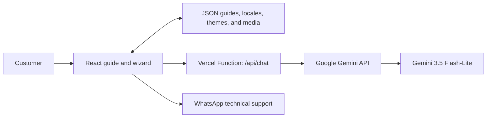

# Transsion Log Guide

[](https://react.dev/)
[](https://www.typescriptlang.org/)
[](https://vite.dev/)
[](https://customers-guide.vercel.app/)
[](LICENSE)

A responsive, multilingual support experience that guides Infinix, TECNO, and itel customers through collecting complete Android diagnostic evidence. The application combines brand-specific visual identities, interactive step-by-step instructions, annotated media, ADB workflows, and a context-aware AI assistant.

**Live application:** [customers-guide.vercel.app](https://customers-guide.vercel.app/)

## Overview

Collecting useful device logs is easy to get wrong: a missing log category, an expired wireless pairing code, or a screen recording started too late can invalidate the evidence package. Transsion Log Guide turns that operational process into a guided workflow with explicit checkpoints, visual references, exact commands, and focused troubleshooting.

The project currently supports:

- **Brands:** Infinix (XOS), TECNO (HiOS), and itel.
- **Languages:** English, Brazilian Portuguese, Latin American Spanish, and Simplified Chinese.
- **PC workflow:** USB debugging and Android Platform Tools (`adb`).
- **No-computer workflow:** Termux and Wireless debugging on Android 11 or later.
- **Evidence capture:** DebugLoggerUI, screen recording, log export, and final package verification.
- **Assisted support:** A contextual AI helper with escalation to WhatsApp technical support.

## Key Features

- Brand-aware themes and instructions selected at runtime.
- Responsive wizard designed for desktop, tablet, and mobile screens.
- Persistent progress, language, and theme preferences through `localStorage`.
- Dark and light themes with keyboard-accessible navigation.
- Searchable instructions, image enlargement, annotated screenshots, and embedded videos.
- Exact ADB commands with separate USB and wireless-debugging paths.
- Validation of the expected `debuglogger` folder contents before submission.
- A floating AI assistant that receives the current language, brand, method, and guide step as context.
- Direct handoff to technical support through [WhatsApp](https://wa.me/5511986543471).

## Supported Workflows

### PC + USB ADB

The PC flow covers Android Platform Tools installation, Developer options, USB debugging, device authorization, DebugLoggerUI preparation, evidence capture, `adb pull`, screen-recording transfer, and final verification.

### Termux + Wireless ADB

The mobile-only flow covers Termux installation, `android-tools`, split-screen operation, temporary wireless pairing credentials, the distinct pairing and connection ports, log export to `Download`, and file verification. It is intended for Android 11 or later and does not require a computer or USB debugging.

## Architecture



The guide is configuration-driven. Brand themes and guide JSON files are discovered during the Vite build, while the AI assistant is isolated behind a server-side Vercel Function so the Gemini API key is never shipped to the browser.

## Technology Stack

| Area | Technology |
| --- | --- |
| UI | React 19, TypeScript, Framer Motion, Lucide React |
| Build | Vite 7, pnpm |
| Styling | Tailwind CSS, PostCSS, project-level CSS |
| Internationalization | i18next, react-i18next |
| Navigation | React Router with `HashRouter` |
| AI | Vercel AI SDK, Google Generative AI, Gemini 3.5 Flash-Lite |
| Hosting | Vercel; optional static deployment through GitHub Pages |

## Project Structure

```text
.
├── api/
│   └── chat.ts                  # Server-side contextual support assistant
├── public/
│   ├── brandmarks/              # Local brand logos
│   ├── flags/                   # Language selector assets
│   ├── illustrations/           # Instructional artwork
│   ├── screenshots/             # Annotated process evidence
│   └── videos/                  # Embedded procedure recordings
├── src/
│   ├── components/              # Reusable UI and assistant components
│   ├── context/                 # Session, theme, and progress state
│   ├── guides/<brand>/          # PC and mobile guide definitions
│   ├── locales/<locale>/        # Translated interface and guide content
│   ├── pages/                   # Wizard stages and guide view
│   ├── themes/                  # Brand-specific visual systems
│   └── types/                   # Shared TypeScript contracts
├── vercel.json                  # Vercel build configuration
└── vite.config.ts               # Vite configuration
```

## Getting Started

### Prerequisites

- Node.js 22 or later.
- pnpm 11.9.0 or a compatible release.
- Vercel CLI for local testing of the serverless assistant.

### Installation

```bash
git clone https://github.com/PettaDev/CustomersGuide.git
cd CustomersGuide
pnpm install
```

### Local development

Run the static guide UI:

```bash
pnpm dev
```

Run the complete Vercel environment, including `/api/chat`:

```bash
pnpm dlx vercel dev
```

The standard Vite development server does not emulate the Vercel Function. Use `vercel dev` whenever the assistant endpoint must be tested locally.

## Available Commands

| Command | Description |
| --- | --- |
| `pnpm dev` | Start the Vite development server. |
| `pnpm build` | Type-check the project and create the production bundle in `dist`. |
| `pnpm preview` | Preview the production bundle locally. |
| `pnpm lint` | Run ESLint across the project. |
| `pnpm dlx vercel dev` | Run the UI and Vercel Function together. |

## AI Assistant Configuration

The assistant is implemented in `api/chat.ts` and calls the Google Gemini API only from the server. The API key is read from a server-side Vercel environment variable and is never exposed in client-side code or committed to the repository.

To enable it for a new Vercel project:

1. Create a Gemini API key in [Google AI Studio](https://aistudio.google.com/apikey).
2. Import or link the repository in Vercel.
3. Add `GOOGLE_GENERATIVE_AI_API_KEY` as a sensitive environment variable for Production and Preview.
4. Deploy the project normally.

The default model is the stable `gemini-3.5-flash-lite`, which is available in the Gemini API free tier with usage limits. Set the optional server-side `GEMINI_MODEL` environment variable to use another compatible Gemini model.

The endpoint applies same-site checks, request-size limits, bounded conversation history, and input normalization. It is deliberately scoped to the documented log-capture process and escalates unsupported cases to technical support. Google may use free-tier request content to improve its products, so the assistant must not request logs, credentials, IMEI numbers, pairing codes, or other personal information.

## Content and Localization

The application discovers most content at build time:

- Add or edit brand workflows in `src/guides/<brand>/pc.json` and `mobile.json`.
- Add translations in `src/locales/<locale>/translation.json` and register the locale in the i18n and language configuration.
- Add visual identity values in `src/themes/<brand>.ts`.
- Store media under the appropriate `public` subdirectory and reference it with a relative public URL.

Keep translated keys aligned across all four locale files. New procedural steps should include a clear outcome, exact command syntax when applicable, and an evidence checkpoint.

## Deployment

### Vercel (recommended)

Vercel is the recommended target because it serves both the Vite application and the `/api/chat` function. The repository includes `vercel.json` with the production build command and output directory.

1. Import the GitHub repository into Vercel.
2. Confirm the framework preset is Vite.
3. Keep `pnpm build` as the build command and `dist` as the output directory.
4. Add the server-side Gemini API key if the assistant is required.
5. Deploy or merge into the configured production branch.

### Private repository behavior

GitHub repository visibility and Vercel deployment visibility are independent controls:

- Making the GitHub repository private does **not** unpublish an existing successful Vercel deployment. The production URL remains online while the Vercel project and deployment remain active.
- Future Git-based deployments require the Vercel GitHub App to retain access to the private repository and the commit author to satisfy Vercel's private-repository authorization rules.
- A private source repository does **not** make the website private. Configure Vercel Deployment Protection separately if access to the deployed application must be restricted.

### GitHub Pages

The included workflow publishes `dist` from `main` as a static site. This is suitable for the guide UI, but GitHub Pages cannot run the Vercel Function, so the AI assistant requires Vercel or another compatible serverless backend.

## Security and Privacy

- No database or end-user account system is used.
- Guide progress, selected language, theme, acknowledgements, and visible chat history stay in the browser's local storage.
- AI requests are sent only to the same-origin serverless endpoint and are limited before model execution.
- Secrets and provider credentials must remain server-side; never place them in `VITE_*` variables.
- Customers should review screenshots, recordings, and exported logs for sensitive information before sharing them with support.
- USB or Wireless debugging should be disabled after the support session is complete.

## Contributing

1. Create a focused feature branch.
2. Keep guide content, translations, and assets synchronized.
3. Run `pnpm lint` and `pnpm build`.
4. Verify both desktop and mobile layouts.
5. Open a pull request describing the user impact and the validation performed.

## Support

For process assistance or cases that require device-specific intervention, contact [technical support on WhatsApp](https://wa.me/5511986543471).

## License

This project is licensed under the [MIT License](LICENSE).
